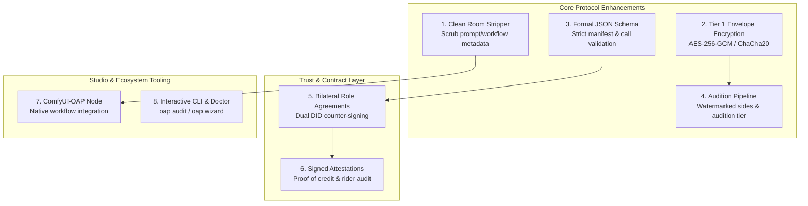

# Open Actor Protocol (OAP) — Strategic Review & Improvement Roadmap

**Target Project**: [hodgemann/oap](https://github.com/hodgemann/oap)  
**Context**: Following the successful hardening of the reference implementation (PR #1), this document analyzes next-generation enhancements to evolve OAP from a specification prototype into a robust industry standard for generative cinema and AI actor management.

---

## 1. Architectural Gap Analysis

While OAP v0.1 establishes a clean conceptual framework, a side-by-side audit of the Whitepaper ([WHITEPAPER.md](WHITEPAPER.md)) against modern generative AI production reveals five fundamental gaps:

| Capability | Whitepaper Spec | Current Code State | Practical Need in Production |
|---|---|---|---|
| **Tier 1: Encrypted-at-Rest** | Promised in v0.1 (§7) | Declaration only in JSON | LoRAs and voice anchors need real at-rest encryption to stop casual leak/theft. |
| **Clean Room Rule** | Mandated in §7.1 | Unimplemented in tooling | ComfyUI routinely embeds entire prompt graphs & API keys inside output PNG chunks (`tEXt`/`iTXt`). |
| **Audition Clearance** | Listed in §6 table | No packaging logic | Need automated pipeline to build watermarked, audition-only side clips without exposing identity assets. |
| **Bilateral Contracts** | Described in §10 | Single-party casting call only | Need counter-signed agreement binding Director DID + Actor DID to terms, rate, and delivery hash. |
| **Attestation System** | Reserved in §13 | Schema not implemented | Decentralized reputation and rider violation flagging need verifiable data structures. |

---

## 2. Proposed Improvements & New Capabilities



---

### Improvement 1: Built-in "Clean Room" Stripping Rule (`oap clean-room`)
* **Whitepaper Alignment**: Section 7.1 ("The CLEAN ROOM rule").
* **Problem**: In generative workflows (especially ComfyUI, Automatic1111, and Forge), image and video save nodes inject the complete generation graph, seed parameters, negative prompts, and sometimes API keys into PNG metadata (`tEXt`, `zTXt`, `iTXt` chunks) or MP4 user-data atoms. In multi-studio or agent auditions, this leaks the Director's proprietary workflow and prompts.
* **Proposed Implementation**:
  - Add `oap.clean_room` utility and CLI command:
    ```bash
    oap clean-room --input ./render.png --out ./clean_render.png
    oap clean-room --input ./audition.mp4 --out ./clean_audition.mp4
    ```
  - Standard pure-Python PNG chunk filter that preserves essential color profiles (sRGB/iCCP) while scrubbing `prompt`, `workflow`, `parameters`, and extraneous EXIF.
  - Video re-packaging or metadata sanitization via container stripping.

---

### Improvement 2: Operationalize Tier 1 (Encrypted-at-Rest Package)
* **Whitepaper Alignment**: Section 7 ("Tier 1: Encrypted at rest; program decrypts in memory; no plaintext on disk").
* **Problem**: Currently, `.oap` files are standard unencrypted ZIPs regardless of tier. Any user with 7-Zip can inspect `identity/` assets directly.
* **Proposed Implementation**:
  - Use `cryptography.hazmat.primitives.ciphers.aead.AESGCM` or `ChaCha20Poly1305` (already available via the `cryptography` dependency).
  - Encrypt all `clearance: "cast"` assets before packaging.
  - **Envelope Encryption**: Store an `encrypted_payload.bin` along with an encryption descriptor in `manifest.json`:
    ```json
    "protection": {
      "tier": 1,
      "mechanism": "aes256_gcm",
      "key_derivation": "scrypt",
      "salt": "<base64>",
      "access_endpoint": "https://agent.example/v1/unlock"
    }
    ```
  - Provide an in-memory decryption stream helper (`oap.open_asset_buffer(oap_path, asset_path, key)`) so host studios can load weights or audio anchors directly into PyTorch / librosa without writing unencrypted files to disk.

---

### Improvement 3: Formal JSON Schema & Typed Manifest Models
* **Problem**: Manifest parsing in `core.py` currently relies on brittle nested dictionary lookups (`manifest.get("visual", {}).get("sheets", [])`). If a manifest is malformed or fields use unexpected types, failures are silent or obscure.
* **Proposed Implementation**:
  - Add formal [JSON Schema](https://json-schema.org/) specifications for:
    1. `oap.actor.manifest.schema.json`
    2. `oap.casting_call.schema.json`
    3. `oap.role_agreement.schema.json`
    4. `oap.attestation.schema.json`
  - Provide an `oap audit` or `oap validate` command:
    ```bash
    oap validate --manifest ./manifest.json
    ```
  - Include dataclasses / typed dicts in Python for IDE auto-completion and static analysis (`mypy`).

---

### Improvement 4: The Audition Package Pipeline (`tier: audition`)
* **Whitepaper Alignment**: Section 6 & Section 10 ("Blind-side audition").
* **Problem**: The Whitepaper defines an `audition` clearance tier, but `core.py` only implements `portfolio` and `full`. There is no tooling to produce an audition package in response to a casting call.
* **Proposed Implementation**:
  - Add `audition` tier to `package_actor`:
    - Includes `portfolio/` assets plus audition-specific side recordings.
    - Excludes full identity assets (`identity/ref.png`, master un-watermarked voice anchor, raw LoRA weights).
  - Add audition response workflow:
    ```bash
    oap audition-package --source ./actor_src --call ./casting_call.json --side-clip ./take_1.mp4 --out ./audition.oap
    ```

---

### Improvement 5: Bilateral Role Agreement (Counter-Signed Contract)
* **Problem**: Currently, a casting call is a one-way declaration by a Director, and a manifest is a one-way declaration by an Agent. When a role is cast, there is no canonical document capturing mutual agreement.
* **Proposed Implementation**:
  - Define `oap.role_agreement`:
    ```json
    {
      "oap_version": "0.1.0",
      "kind": "oap.role_agreement",
      "agreement_id": "agree_2026_001",
      "call_id": "call_2026_noir_001",
      "actor_did": "oap:ed25519:<actor-key>",
      "director_did": "oap:ed25519:<director-key>",
      "manifest_sha256": "<manifest-hash>",
      "accepted_compensation": { "amount": "150", "currency": "USD" },
      "rider_amendments": [],
      "created_at": "2026-09-11T12:00:00Z",
      "signatures": {
        "director": { "value": "<sig-1>", "signed_at": "..." },
        "agent": { "value": "<sig-2>", "signed_at": "..." }
      }
    }
    ```
  - Provide `oap sign-agreement` CLI command for mutual signing.

---

### Improvement 6: DID-Based Attestation & Reputation Ledger Schema
* **Whitepaper Alignment**: Section 13 ("Reputation & Sybil Resistance").
* **Problem**: Reputations and rider violation reports are currently theoretical. Without a standard data format, different studios cannot share trust or credit data.
* **Proposed Implementation**:
  - Define `oap.attestation`:
    - Types: `production_credit` (proof an actor completed a role), `rider_compliance_verified`, or `rider_violation_report`.
    - Signed by attester DID.
    - Includes evidence hashes (e.g. hash of published video, agreement hash).
  - CLI:
    ```bash
    oap attest --subject <actor_did> --type production_credit --details ./credit.json --sign @priv.key
    oap verify-attestation --attestation ./attestation.json
    ```

---

### Improvement 7: Multi-Modal Avatar Assets (Modernizing Identity Schema)
* **Problem**: Generative filmmaking in 2026 utilizes more than static 2D images and WAV audio. Avatars now require expression anchors, motion models, and 3D head geometry.
* **Proposed Implementation**:
  - Extend `visual` manifest section:
    - `expression_anchor`: Canonical neutral landmark vector or 3D blendshape reference (compatible with LivePortrait / EchoMimic / Flame).
    - `motion_lora`: Motion dynamics LoRA weights.
  - Extend `voice` manifest section:
    - Support zero-shot latent prompt tokens (e.g. CosyVoice, F5-TTS, Chatterbox speaker latents) alongside raw audio anchors.

---

### Improvement 8: ComfyUI / Studio Integration (`ComfyUI-OAP`)
* **Problem**: Directors and AI cinematographers create films inside ComfyUI and local generation studios. Having to manually jump out to a command line to unzip and verify an actor breaks creator flow.
* **Proposed Implementation**:
  - A lightweight custom node pack (`ComfyUI-OAP`):
    - **OAP Load Actor Node**: Drops an `.oap` file into ComfyUI. Automatically verifies the signature, loads the LoRA directly, and outputs the `visual_contract` prompt string and reference image latents.
    - **OAP Clean Room Save Node**: Automatically strips internal prompt workflows on render save when delivering final shots or audition takes.

---

## 3. Recommended Phased Implementation Roadmap

### Phase 1: Near-Term (v0.2.0)
1. **Clean Room Stripper**: Implement PNG chunk scrubber and EXIF sanitizer (`oap clean-room`).
2. **Formal Validation**: Introduce JSON schema validation and `oap validate` CLI command.
3. **Audition Packaging Tier**: Add `audition` clearance tier to `package_actor`.

### Phase 2: Medium-Term (v0.3.0)
1. **Tier 1 At-Rest Encryption**: Implement AES-256-GCM encrypted payload packaging and in-memory decryption buffers.
2. **Bilateral Agreements**: Implement `oap.role_agreement` schema and counter-signing CLI.
3. **Attestation Schema**: Define and verify signed attestations (`oap.attestation`).

### Phase 3: Ecosystem Expansion (v0.4.0+)
1. **ComfyUI-OAP Custom Nodes**: Native visual workflow integration.
2. **Multi-Modal Identity Extensions**: Expression anchors and audio latents.
3. **Magic Wormhole Transport**: Direct box-to-box transport integration.
